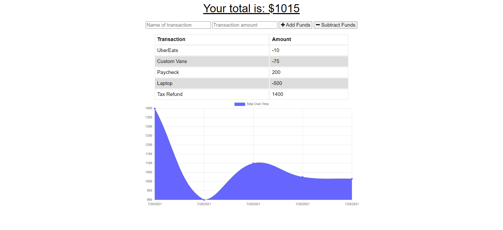

# budget-tracker

Nineteenth week's homework for UNH Full-Stack Web Development Boot Camp

## Description

The goal of this project was to add functionality to an existing Budget Tracker application to allow for offline access and functionality. Our main tasks were to ensure that:

* The user can enter deposits or expenses offline.

* When the user inputs a withdrawal or deposit while offline, then that will be shown on the page, and added to their transaction history when their connection is back online.

## Built With

* Javascript
* Mongoose
* MongoDB

## Links

* [GitHub Repository](https://github.com/shabobble/budget-tracker)
* [Deployed app](https://boiling-thicket-92493.herokuapp.com/)

## Screenshot

## Installation

No installation required

## Credits

* Instructor - Gabe Perry [GitHub](https://github.com/Gperry22)
* TA - Andrew Hatfield
* Tutor - Joseph Young
* Study Group - Alan Balcom [GitHub](https://github.com/abalcs)

## __License__ 

 This project is licensed under the [MIT License](https://choosealicense.com/licenses/mit). 